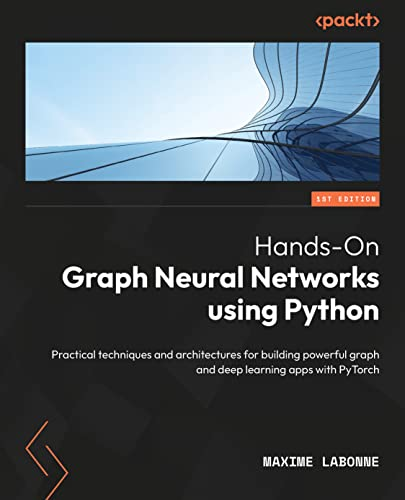

I am thrilled to introduce my book on graph neural networks, which is the result of almost a year's worth of hard work, research, and collaboration with fellow experts in the field. As someone who's passionate about GNNs, I wanted to create a **comprehensive guide that could help both beginners and advanced practitioners**. This book has been carefully crafted to provide a step-by-step guide for those new to the world of GNNs, while also offering advanced use cases and examples for experienced practitioners. What's more, the entire code with examples and use cases is [freely available on Github](https://github.com/PacktPublishing/Hands-On-Graph-Neural-Networks-Using-Python), making it easy for you to get started with implementing GNNs in Python.

If you're interested in graph neural networks, I highly recommend checking it out. I'm confident that you'll find it to be an invaluable resource as you explore this exciting and rapidly growing field.

Unlock the power of graph neural networks to analyze complex data and solve real-world problems with this comprehensive guide.

## 📘 Key Features

* Implement state-of-the-art graph neural network architectures in Python
* Create your own graph datasets from tabular data
* Build powerful traffic forecasting, recommender systems, and anomaly detection applications

## 💼 Book Description

Graph neural networks are a highly effective tool for analyzing data that can be represented as a graph, such as social networks, chemical compounds, or transportation networks. The past few years have seen an explosion in the use of graph neural networks, with their application ranging from natural language processing and computer vision to recommendation systems and drug discovery.

Hands-On Graph Neural Networks Using Python begins with the fundamentals of graph theory and shows you how to create graph datasets from tabular data. As you advance, you'll explore major graph neural network architectures and learn essential concepts such as graph convolution, self-attention, link prediction, and heterogeneous graphs. Finally, the book proposes applications to solve real-life problems, enabling you to build a professional portfolio. The code is readily available online and can be easily adapted to other datasets and apps.

By the end of this book, you'll have learned to create graph datasets, implement graph neural networks using Python and PyTorch Geometric, and apply them to solve real-world problems, along with building and training graph neural network models for node and graph classification, link prediction, and much more.

## 🔑 What you will learn

* Understand the fundamental concepts of graph neural networks
* Implement graph neural networks using Python and PyTorch Geometric
* Classify nodes, graphs, and edges using millions of samples
* Predict and generate realistic graph topologies
* Combine heterogeneous sources to improve performance
* Forecast future events using topological information
* Apply graph neural networks to solve real-world problems

## 💡 Who this book is for

This book is for machine learning practitioners and data scientists interested in learning about graph neural networks and their applications, as well as students looking for a comprehensive reference on this rapidly growing field. Whether you're new to graph neural networks or looking to take your knowledge to the next level, this book has something for you. Basic knowledge of machine learning and Python programming will help you get the most out of this book.

## 🔗 Get your copy now!
[Amazon US](https://a.co/d/hIzOphi) | [Amazon EU](https://amzn.eu/d/5KEhpFu) | [Packt](https://www.packtpub.com/product/hands-on-graph-neural-networks-using-python/9781804617526)